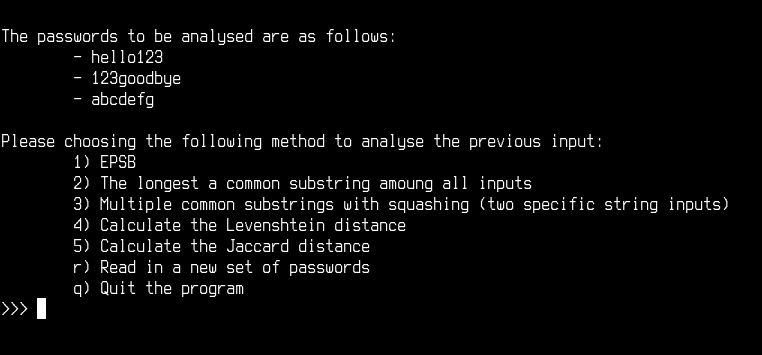
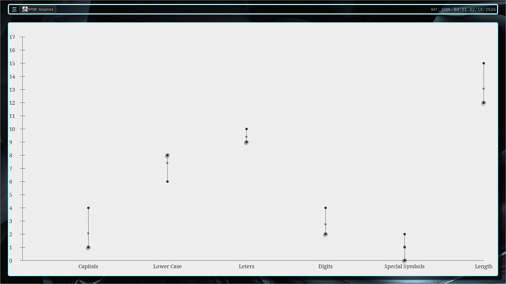

# Welcome to Our 2025-26 USCA Capstone Project
Advisor: Dr. Yilian Zhang
 
Students: Dylan Lott & Brandon Weathers
## Project Description 
Modern technology allows the protection of sensitive information.​ Naturally, the presence of value leads to people with malicious intent.​ Currently, the file EPSB contains methods used to calculate the CR for a given set of passwords that all belong to a single user. This is a college project and is not intended for serious use.
 
 
<u>Our Research Goal:</u>
 
Develop an algorithm to detect malicious users using various metrics including the longest common substring for multiple strings algorithm.​

## Example of Multi Tester Tool

## News
I'm proud to announce that our the Multi Tester Tool is has officially reached version 2.0! 
The Multi Tester Tool now has the following features:

1. EPSB
2. The longest a common substring amoung all inputs
3. Multiple common substrings with squashing (two specific string inputs)
4. Calculate the Levenshtein distance (between the first two passwords)
5. Calculate the Jaccard distance (between the first two passwords)

Ovcourse, all of these features are compatable with the list of (any size) of strings that the user provides.

## How to Run: Testing the Algorithm's Speed on Different Machines 
I realized that on some machines the different algorithms don't scale quite right.
The following instructions only work on Linux and MacOS (actually I'm not sure about MacOS).
- Windows users can manually run each file which has Testing at the end of its name.
- They are located in their respective directories.

1. git fork https://github.com/BrandonWeathers000/USCA_Capstone_DylanLott_BrandonWeathers.git
2. cd /USCA_Capstone_DylanLott_BrandonWeathers/
3. ./TestingScript.sh

# Example of Stastical Analysis

## Notes
For reasons that I don't completely understand, the multiple substrings algorithm is a bit slower.
Really, I think it may be something with the string concatenation or perhaps the way Java references objects and their methods.
If anyone can find out he reason that the suffix tree testing algorithm for multiple strings takes about twice as long as its non-recursive counterpart, I would be appreciative.
This README is maintained by Brandon Weathers.

## Contacts
| Contributor      | Email            | 
|------------------|------------------|
| Dylan Lott       | drlott@usca.edu  |
| Brandon Weathers | brw12@usca.edu   |
| Yilian Zhang     | YilianZ@usca.edu |
